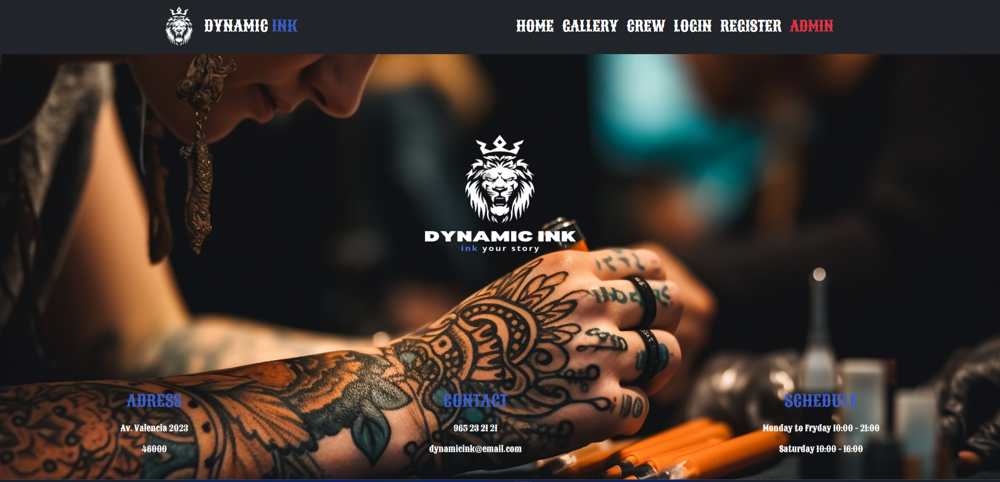
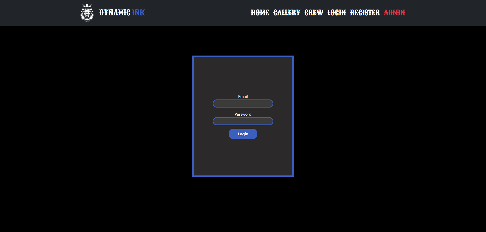
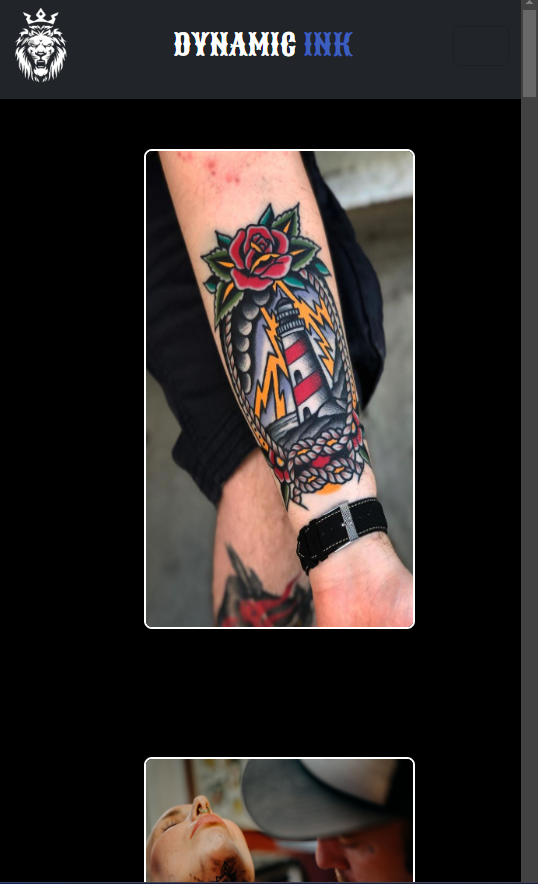

<h1 align="center">☾ - TATTOO STUDIO FRONTEND - ☽</p></h1>

---
### ✪ [Enlace al repositorio](https://github.com/PabloProst/Tattoo-Studio-frontend/tree/master)
### ✪ [Enlace a mi Linkedin](https://www.linkedin.com/in/pablo-ezequiel-prost-926ab6297/)

---

## ⚘ Desarrollo:

``` js
 const developer = "PabloProst";

 console.log("Desarrollado por: " + PabloProst);
```  
---

## &nbsp;&nbsp;&nbsp;&nbsp;&nbsp;&nbsp;&nbsp;&nbsp;&nbsp;&nbsp;&nbsp;&nbsp;&nbsp;&nbsp;&nbsp;&nbsp;&nbsp;&nbsp;&nbsp;&nbsp;&nbsp;&nbsp;&nbsp;&nbsp;&nbsp;&nbsp;&nbsp;&nbsp;&nbsp;&nbsp;&nbsp;&nbsp;&nbsp;&nbsp;&nbsp;&nbsp;:mag: OBJETIVO :mag:

#### ▫︎ FRONTEND REALIZADO EN BASE AL BACKEND DE MI PROYECTO ANTERIOR (PROYECTO 4) ▫︎.
#### Se trata de una web para un estudio de tatuajes en donde el usuario podrá registrarse, loguearse, pedir una cita, ver la galeria de tatuajes, ver información sobre los trabajadores y muchas mas funciones.

---

## Tecnologías utilizadas:

#### ✒︎ HTML
#### ✒︎ CSS
#### ✒︎ JAVASCRIPT
#### ✒︎ BOOSTRAP
#### ✒︎ GITHUB

---
## &nbsp;&nbsp;&nbsp;&nbsp;&nbsp;&nbsp;&nbsp;&nbsp;&nbsp;&nbsp;&nbsp;&nbsp;&nbsp;&nbsp;&nbsp;&nbsp;&nbsp;&nbsp;&nbsp;&nbsp;&nbsp;&nbsp;&nbsp;&nbsp;&nbsp;&nbsp;:rocket: HOME PAGE :rocket:




---

## :gear: VISTAS :gear:
#### ✒︎ HOME
#### ✒︎ LOGIN/REGISTER
#### ✒︎ PROFILE
#### ✒︎ CREW
#### ✒︎ GALLERY
#### ✒︎ APPOINTMENTS
#### ✒︎ ARTIST PANEL (ADMIN)
#### ✒︎ ADMIN PANEL (SUPER ADMIN)
----


----

## :gear: RESPONSIVE :gear:

#### La aplicación es completamente responsive, facilitando su visualización en PC y móviles.


---

## :mag: A MEJORAR :mag:

#### En un futuro la aplicación contará con un mejor diseño ya que el que trae es muy básico.
#### se removerán líneas de código que no están en uso y se le añadirán funciones a la aplicación, como por ejemplo "EDITAR" las citas ya creadas. 
#### También se agregarán comentarios cuando la contraseña o el email son incorrectos al momento de loguearse.

---
## ✦ Licencia ✦
Este proyecto se encuentra bajo licencia de "Pablo Prost"